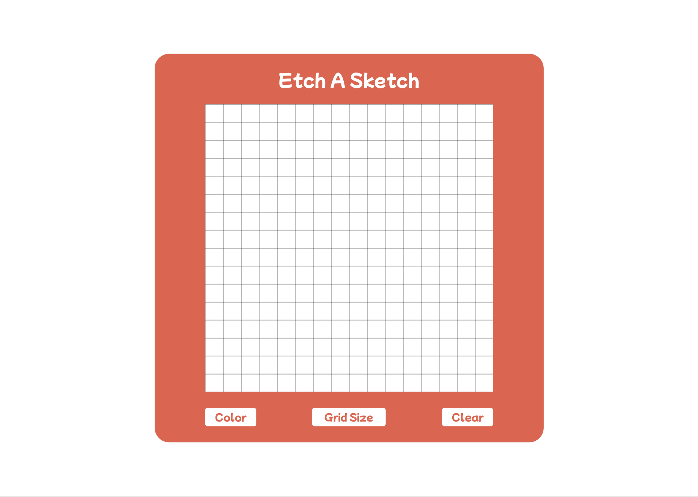
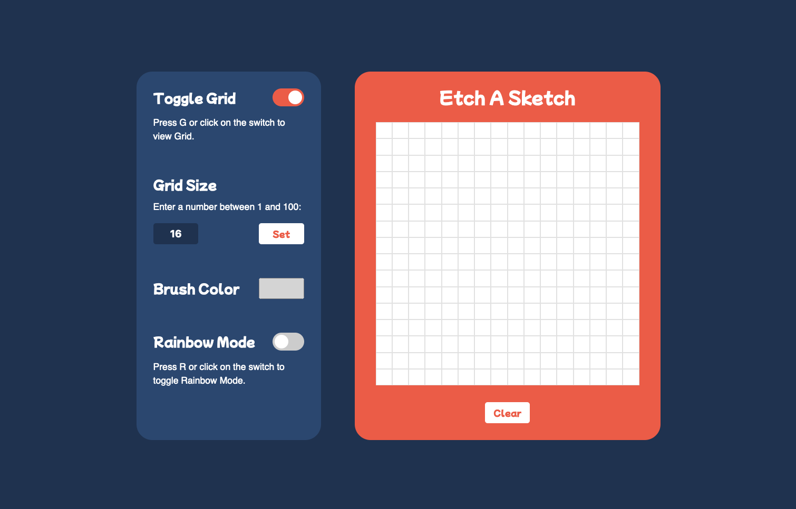

# Etch A Sketch

## Overview
Click here to see it live: [https://victorzottmann.github.io/etch-a-sketch/](https://victorzottmann.github.io/etch-a-sketch/)

Based on the popular toy Etch A Sketch, this project is a web app that allows users to draw and sketch on a virtual canvas. It consists of a few customizable configuration features, such as grid size, color selection, and even a rainbow drawing mode. Users can also choose to enable or disable the grid layout.

At first, I designed a **low-fidelity prototype** to make it easier to think about the code and its features. 

And this is the **final design**: 

## UI/UX Decisions

### Color Contrast
I chose a color scheme that would not only look nice but whose contrast between the foreground and background colors also complied the WCAG Accessibility Guidelines for color contrast (`AA` and `AAA`).

#### Link to the contrast checker: [Link to WebAIM's contrast checker](https://webaim.org/resources/contrastchecker/)

In addition, I opted for a dark blue background in order for the experience to be easier on the eyes as opposed to the original white background. 

### Design Principles
In order to minimize cognitive load, I adopted a minimal design for the user interface and made sure to maintain elements consistent across the board. For example, all the available settings are located in a menu bar to the left of the drawing board.

In contrast, since clearing the drawing board would potentially be something that users would do more frequently, I opted to place a button at the bottom of the board to make it easier to access it.
